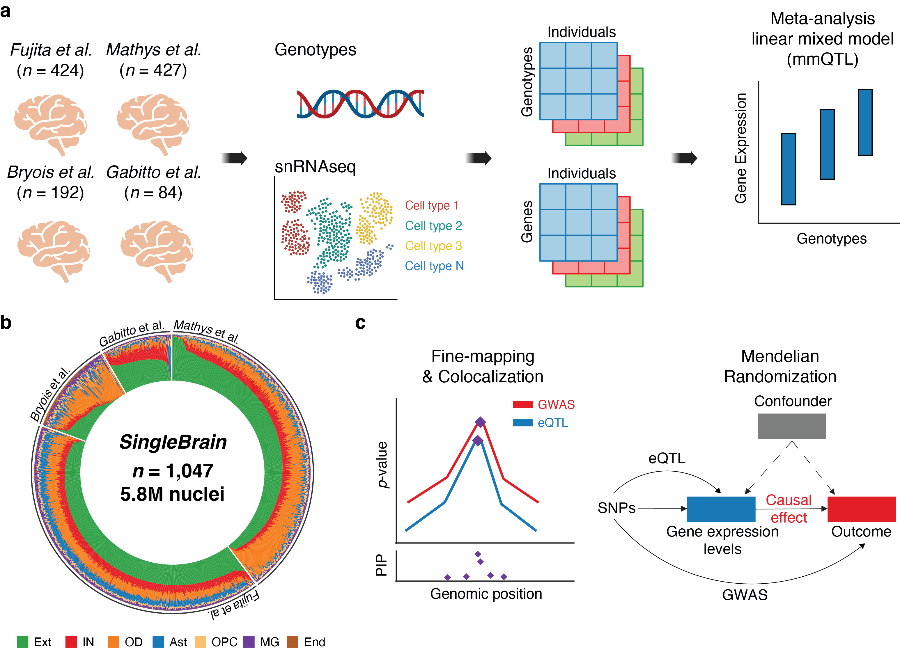

# SingleBrain: A Meta-Analysis of Single-Cell eQTLs Linking Genetic Risk to Brain Disorders

> Beomjin Jang, Hong-Hee Won, Towfique Raj

> This repository includes code and plots. Exploratory analysis and intermediate processing files are too large for this repository.

> [Preprint](https://pmc.ncbi.nlm.nih.gov/articles/PMC11908325/) on MedRxiv is available.

> SingleBrain eQTL browser is accessible at [https://singlebrain.nygenome.org](https://singlebrain.nygenome.org).

> All *cis*-eQTL summary statistics are accessible at [https://zenodo.org/records/14908182](https://zenodo.org/records/14908182) and Bonferroni-corrected significant *trans*-eQTL summary statistics are accessible at [https://zenodo.org/records/15860673](https://zenodo.org/records/15860673). 

> All disease-/sex-specific eQTL summary statistics are accessible at [https://zenodo.org/records/16051904](https://zenodo.org/records/16051904).

## Description 

> A eQTL meta-analysis, called "***SingleBrain***", integrates publicly available snRNA-seq and genotype data from four independent cohorts: *Fujita* et al., *Mathys* et al., *Gabitto* et al., and *Bryois* et al.

 

> a) Integration of publicly available single-nucleus RNA sequencing (snRNA-seq) and genotype data from four independent studies. A *cis*-eQTL meta-analysis was conducted across major central nervous system (CNS) cells and subtypes using a linear mixed model approach (multivariate multiple QTL, mmQTL). b) Cell proportion of each donor. c) Candidate genes and putative causal variants associated with neurodegenerative and neuropsychiatric diseases were identified through statistical colocalization, Mendelian randomization, and fine-mapping.

## Scripts
> Code for processing data and plots.

## SAIGE-QTL (*Fujita* et al.)

> To demonstrate how SAIGE-QTL [PMID: 38798318] identifies eQTLs and to compare the results with SingleBrain eQTLs, genome-wide test pipeline using SAIGE-QTL was established and *cis*-eQTL mapping was conducted using the dataset of *Fujita* et al.. 

> SAIGE-QTL pipeline: [https://github.com/RajLabMSSM/SAIGEQTL-pipeline](https://github.com/RajLabMSSM/SAIGEQTL-pipeline).

> All SAIGE-QTL summary statistics are accessible at [https://zenodo.org/records/15860973](https://zenodo.org/records/15860973).

## Authors

> Contributors names and contact info

- Beomjin Jang (beomjin.jang@mssm.edu)

- Hong-Hee Won (wonhh@skku.edu)
  
- Towfique Raj (towfique.raj@mssm.edu)

